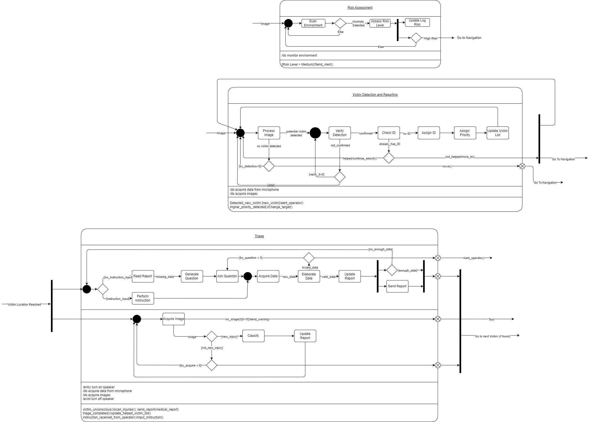

Behavioral Diagram
==================

The following section presents the **Behavioral State Machine** designed to guide the autonomous decision-making processes of the robotic system during search and rescue operations.
The diagram (see figure below) illustrates the high-level behavior of the robot as it navigates between critical operational states such as risk assessment, victim detection, and triage activities.

The structure is modular, enabling robust, reactive behaviors while maintaining clear transitions among different stages depending on environmental and victim conditions.

Overview of the Diagram
------------------------

The Behavioral Diagram is organized into three major functional blocks:

- **Risk Assessment**
- **Victim Detection and Reporting**
- **Triage**

Each block is responsible for a critical mission aspect and incorporates specific functionalities and transitions to manage uncertainties in disaster environments.

1. Risk Assessment
------------------

**Purpose:**  
To autonomously analyze the surrounding environment and identify potential structural risks that may compromise navigation safety or endanger human lives.

**Key Activities:**

- **Scan Environment:** Continuously monitor the environment using a combination of RGB-D cameras, LiDARs, SONARs, and IMUs sensors.
- **Anomaly Detection:** Detect visible cracks, structural deformations, and instability.
- **Assess Risk Level:** Classify anomalies into risk categories (Low, Medium, High).
- **Update Log and Send Alerts:** Record observations and update the navigation system in case of high risk.

**Transitions:**

- **High Risk Detected:** Send an alert and immediately notify the human operator.
- **No Anomalies:** Continue standard exploration.

2. Victim Detection and Reporting
----------------------------------

**Purpose:**  
To autonomously locate and preliminarily assess potential victims using visual and auditory data, supporting quick triage and prioritization.

**Key Activities:**

- **Process Image:** Analyze visual data from the RGB-D camera to detect human presence.
- **Verify Detection:** Confirm the presence of a victim through additional sensory validation.
- **Check and Assign ID:** Ensure no duplication and assign a unique identifier based on spatial references.
- **Assign Priority:** Categorize victims according to pre-set emergency severity criteria.
- **Update Victim List:** Maintain an updated list for navigation and reporting.

**Transitions:**

- **Victim Confirmed and New:** Direct navigation to the victim’s location.
- **No New Victim Detected:** Resume exploration.
- **Higher Priority Victim Found:** Change current target accordingly.

3. Triage
---------

**Purpose:**  
To perform an initial medical assessment of the victim upon reaching their location, generating a preliminary medical report to assist emergency teams.

**Key Activities:**

- **Read Report:** Search the data missing from the report.
- **Generate Question:** Generate the question autonomously or passed by the human operator.
- **Acquire Data:** Acquire the data from vision and michropones.
- **Elaborate Data:** Elaborate the acquire data to estimate the conciusness and the state of the victim.
- **Update and Send Report:** Consolidate data into a structured triage report and transmit it to the operator.
- **Perform Instructions:** Execute specific actions upon operator request using the robot’s speaker system or ask to the victim to do so.
- **Acquire image:** Acquire an image of the victim to be used in the repor.
- **Classify:** Classify the victim’s injurues based on the acquired data.

**Transitions:**

- **Triage Complete:** Update victim status and proceed to the next objective.
- **Unconscious Victim Detected:** Send an urgent medical report based on injury analysis.
- **Operator Instructions:** Carry out requested actions before resuming exploration.

Notes
-----

- The Behavioral State Machine is designed to operate continuously in real-time, handling dynamic changes in environmental conditions and victim prioritization.
- Each major state features internal sub-processes for data acquisition, verification, and structured decision-making.
- Critical transitions between states ensure that both risk and victim conditions are always re-evaluated at each operational cycle.

Graphical Representation
-------------------------

.. note::

   The visual state machine diagram summarizing these behavioral states and their transitions is included below.

